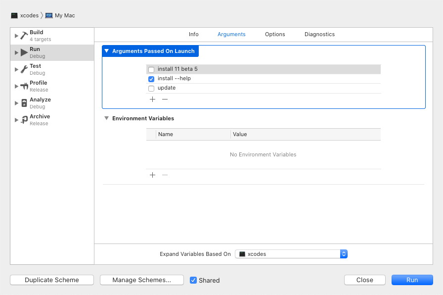

# xcodes

The best command-line tool to install and switch between multiple versions of Xcode.

_If you're looking for an app version of `xcodes`, try [Xcodes.app](https://github.com/XcodesOrg/XcodesApp)._


### :tada: Announcment

Xcodes is now part of the `XcodesOrg` - [read more here](nextstep.md)

## Installation

### Homebrew (Preferred)

```sh
brew install xcodesorg/made/xcodes
```

These are Developer ID-signed and notarized release builds and don't require Xcode to already be installed in order to use.

**Other methods:**

<details>
<summary>Download a release</summary>

Download the latest release from the [Releases](https://github.com/XcodesOrg/xcodes/releases) page. These are Developer ID-signed release builds and don't require Xcode to already be installed in order to use.
</details>

<details>
<summary>Using <a href="https://github.com/yonaskolb/Mint">Mint</a></summary>

```sh
mint install XcodesOrg/xcodes
```

</details>

<details>
<summary>Build from source</summary>

Building from source requires Xcode 12.0 or later, so it's not an option for setting up a computer from scratch.

```sh
git clone https://github.com/XcodesOrg/xcodes
cd xcodes
make install
# or, if /usr/local/ isn't in your PATH
PREFIX=/your/install/directory make install
```

While installing, you may get the following output:

```sh
swift build
error: terminated(72): xcrun --sdk macosx --find xctest output:
```

If that occurs, it means you need to select a version of Xcode. You can do this with `xcode-select` or by choosing a Command Line Tools option in Xcode's preferences Locations tab.
</details>

## Usage

### Install Xcode : 

Install a specific version of Xcode using a command like one of these:

```sh
xcodes install 10.2.1
xcodes install 11 Beta 7
xcodes install 11.2 GM seed
xcodes install 9.0 --path ~/Archive/Xcode_9.xip
xcodes install --latest-prerelease
xcodes install --latest --directory "/Volumes/Bag Of Holding/"
xcodes install --latest --experimental-unxip
```

You'll then be prompted to enter your Apple ID username and password. You can also provide these with the `XCODES_USERNAME` and `XCODES_PASSWORD` environment variables.

After successfully authenticating, xcodes will save your Apple ID password into the keychain and will remember your Apple ID for future use. If you need to use a different Apple ID than the one that's remembered, set the `XCODES_USERNAME` environment variable.

xcodes will download and install the version you asked for so that it's ready to use.

```sh
(1/6) Downloading Xcode 11.2.0: 100%
(2/6) Unarchiving Xcode (This can take a while)
(3/6) Moving Xcode to /Applications/Xcode-11.2.0.app
(4/6) Moving Xcode archive Xcode-11.2.0.xip to the Trash
(5/6) Checking security assessment and code signing
(6/6) Finishing installation
xcodes requires superuser privileges in order to finish installation.
macOS User Password:

Xcode 11.2.0 has been installed to /Applications/Xcode-11.2.0.app
```

If you have [aria2](https://aria2.github.io) installed (it's available in Homebrew, `brew install aria2`), then xcodes will default to use it for downloads. It uses up to 16 connections to download Xcode 3-5x faster than URLSession.

Xcode will be installed to /Applications by default, but you can provide the path to a different directory with the `--directory` option or the `XCODES_DIRECTORY` environment variable. All of the xcodes commands support this option, like `select` and `uninstall`, so you can manage Xcode versions that aren't in /Applications. xcodes supports having all of your Xcode versions installed in _one_ directory, wherever that may be.

### Install Runtimes : 

Run this command line to display the available runtimes 

```sh
xcodes runtimes --include-betas
```

Install the wanted Runtime (ex. iOS 17.0-beta1)

```sh
xcodes runtimes install "iOS 17.0-beta1"
```

### `.xcode-version`

We recommend the creation of a `.xcode-version` file to explicitly declare and store the Xcode version to be used by your CI environment as well as your team.

```txt
13.4.1
```

Read [the proposal](/XCODE_VERSION.md) of `.xcode-version`.

### Commands

- `download <version>`: Download a specific version of Xcode
- `install <version>`: Download and install a specific version of Xcode
- `installed`: List the versions of Xcode that are installed
- `list`: List all versions of Xcode that are available to install
- `select`: Change the selected Xcode
- `uninstall`: Uninstall a specific version of Xcode
- `update`: Update the list of available versions of Xcode
- `version`: Print the version number of xcodes itself
- `signout`: Clears the stored username and password

### Experimental Unxip - for faster unxipping

Thanks to the amazing work by [saagarjhi](https://github.com/saagarjha/unxip) - Xcodes now includes the ability to unxip up to 70% faster on some systems.

```sh
xcodes install --latest --experimental-unxip
```

### Shell Completion Scripts

xcodes can generate completion scripts which allow you to press the tab key on your keyboard to autocomplete commands and arguments when typing an xcodes command. The steps to install a completion script depend on the shell that you use. More information about installation instructions for different shells and the underlying implementation is available in the [swift-argument-parser repo](https://github.com/apple/swift-argument-parser/blob/main/Sources/ArgumentParser/Documentation.docc/Articles/InstallingCompletionScripts.md).

<details>
<summary>Zsh, with oh-my-zsh:</summary>

Run the following commands:

```sh
mkdir ~/.oh-my-zsh/completions
xcodes --generate-completion-script > ~/.oh-my-zsh/completions/_xcodes
```

</details>

## Development

You'll need Xcode 13 in order to build and run xcodes.

<details>
<summary>Using Xcode</summary>
Even though xcodes is a command-line app, all of the normal functionality works in Xcode, like building, running, and running tests. You can even type text into Xcode's console when it prompts you for input like your Apple ID or 2FA code.

When running xcodes from Xcode, if you want to run a particular command or pass some arguments, you can hold the option key to present a sheet with more options. This means you'd use <kbd>Option</kbd> + <kbd>Command</kbd> + <kbd>R</kbd> or hold <kbd>Option</kbd> while clicking the Run button. Here you can add, remove, and toggle arguments that will be passed to xcodes when it's launched.


</details>

<details>
<summary>Using Swift command line tools</summary>
You can also use the Swift command line tools once you have Xcode installed:

- Build: `swift build`
- Run: `swift run`, or commands like `swift run xcodes list`
- Run tests: `swift test`

</details>

There's a Makefile to help build xcodes for distribution. We already do this for you in order to provide Developer ID-signed and notarized release builds via Homebrew (see [Installation](#installation)).

<details>
<summary>Releasing a new version of xcodes</summary>

```sh
# Bump the version number in Version.swift, commit the change, and tag it
vim Sources/XcodesKit/Version.swift
git add Sources/XcodesKit/Version.swift
git commit -m "Bump version to $VERSION"
git tag -asm "$VERSION" "$VERSION"

# Clean first
make clean

# Make a release build of xcodes, sign it, and zip it
make zip
# Create a Homebrew bottle
make bottle VERSION="$VERSION"

# Notarize the release build
# This can take a while
make notarize \
    TEAMID="ABC123"

# Push the new version bump commit and tag
git push --follow-tags

# Edit the draft release created by Release Drafter to point at the new tag
# Set the release title to the new version
# Duplicate xcodes-$VERSION.mojave.tar.gz and rename to xcodes-$VERSION.arm64_mojave.tar.gz
# Add the xcodes.zip, xcodes-$VERSION.mojave.tar.gz, xcodes-$VERSION.arm64_mojave.tar.gz files to the release
# Publish the release

# Update the Homebrew Bottle: https://github.com/XcodesOrg/homebrew-made/blob/master/Formula/xcodes.rb
```

</details>

Notable design decisions are recorded in [DECISIONS.md](./DECISIONS.md). The Apple authentication flow is described in [Apple.paw](./Apple.paw), which will allow you to play with the API endpoints that are involved using the [Paw](https://paw.cloud) app.

[`xcode-install`](https://github.com/xcpretty/xcode-install) and [fastlane/spaceship](https://github.com/fastlane/fastlane/tree/master/spaceship) both deserve credit for figuring out the hard parts of what makes this possible.

## Maintainers

[Matt Kiazyk](https://github.com/mattkiazyk) - [Twitter](https://www.twitter.com/mattkiazyk)
